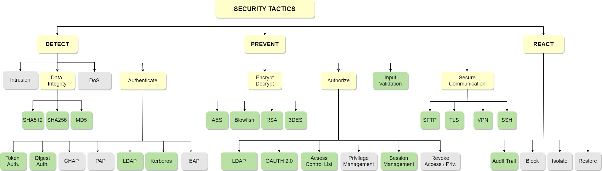

## Tactic Data and Scripts

This repo provides the security tactic catalog, the training data sets and scripts included in the paper entitled "A Novel Approach to Identify Security Controls in Source Code".

##
 
 
Brief description of each directory in the repo:

## data
- The data sets used to train and test models for each security tactic.
- In each csv file the column named "text" includes the text/code to be classified and the column named "class" includes the label.
- Related and unrelated code snippets of each tactic are used to predict whether a code piece is tactic related or not.

## case_study
- Labeled test data sets for three common security tactics identified in the Liferay project (https://github.com/liferay/liferay-portal).

## script/pytorch_notebooks
- The pytorch notebooks and helper functions that can be executed in Google Colab.